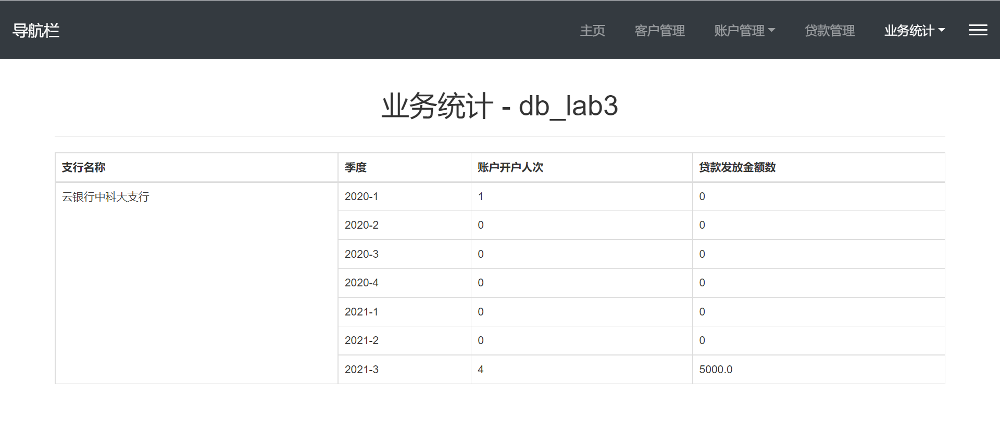

# 数据库lab3

[TOC]

## 大致思路

- 完成实验时，使用flask+python基于静态页面和动态数据，生成动态页面；静态页面使用jinjia模板库做模板渲染，模板在bootstrap示例的基础上修改而成；
- 后续考虑将架构修改为前后端分离式的架构，详见收藏夹几个网站。

## 食用方法

- 大致目录结构如下：

  ```zsh
  /root/database_learning/lab3
  ├── data
  │   ├── backup.sql		数据库全备份
  │   ├── bank.sql		初始数据库文件
  │   └── testdata.sql	初始测试数据
  ├── figs
  │   ├── 存放README.md的图片
  ├── flask_demo
  │   ├── util.py			用到的小函数，如自动获取日期区间中每年、每月、每季度
  │   ├── db.py			数据库处理函数
  │   ├── main.py			flask生成app的python脚本
  │   ├── static
  │   │   ├── css
  │   │   │   ├── 样式文件
  │   │   ├── figs
  │   │   │   └── 404.png
  │   │   ├── fonts		暂时没用
  │   │   └── js
  │   │       ├── 脚本文件
  │   ├── templates
  │   │   ├── 网页模板
  ├── db_lab3.yaml	conda虚拟环境的配置文件
  └── README.md		实验报告/说明文档
  ```
  
- 创建数据库，导入测试数据

  - 创建数据库和访问用户

    

  - 测试用户和授予权限：

    

  - 导入数据库和测试数据：

    登录进MySQL终端，使用db_lab3数据库，`source backup.sql的路径`

- 配置依赖的环境：

  使用了conda创建虚拟环境：`conda env create -f db_lab3.yaml的路径`

- 启动后端，测试登录：

  ```zsh
  conda activate db_lab3	# 进入虚拟环境
  cd main.py所在文件夹
  python main.py
  ```

  打开浏览器，输入url：http://localhost:5000，进入登陆页面，相应输入信息后登录

  我这里遇到了一个小bug，解决方案如下：

  

  

## 系统概述

### 系统目标

​		本系统旨在为银行的业务员提供一个直观方便的数据管理平台，方便银行业务员直接进行客户信息、账户信息、贷款业务的管理；同时为银行的管理者提供一个统计视图，让他们能够对所在支行的业务流水有一个直观的了解。

### 需求说明

1. 数据需求：

   银行有多个支行。各个支行位于某个城市，每个支行有唯一的名字。银行要监控每个支行的资产。银行的客户通过其身份证号来标识。银行存储每个客户的姓名、联系电话以及家庭住址。为了安全起见，银行还要求客户提供一位联系人的信息，包括联系人姓名、手机号、Email 以及与客户的关系。客户可以有帐户，并且可以贷款。客户可能和某个银行员工发生联系，该员工是此客户的贷款负责人或银行帐户负责人。 银行员工也通过身份证号来标识。员工分为部门经理和普通员工，每个部门经理都负责领导其所在部门的员工，并且每个员工只允许在一个部门内工作。每个支行的管理机构存储每个员工的姓名、电话号码、家庭地址、所在的部门号、部门名称、部门类型及部门经理的身份证号。银行还需知道每个员工开始工作的日期，由此日期可以推知员工的雇佣期。 银行提供两类帐户——储蓄帐户和支票帐户。帐户可以由多个客户所共有，一个客户也可开设多个账户，但在一个支行内最多只能开设一个储蓄账户和一个支票账户。每个帐户被赋以唯一的帐户号。银行记录每个帐户的余额、 开户日期、 开户的支行名以及每个帐户所有者访问该帐户的最近日期。另外，每个储蓄帐户有利率和货币类型，且每个支票帐户有透支额。 每笔贷款由某个分支机构发放，能被一个或多个客户所共有。每笔贷款用唯一的贷款号标识。银行需要知道每笔贷款所贷金额以及逐次支付的情况（银行将贷款分几次付给客户）。虽然贷款号不能唯一标识银行所有为贷款所付的款项，但可以唯一标识为某贷款所付的款项。对每次的付款需要记录日期和金额。

2. 业务功能需求：

   - **客户管理：**提供客户所有信息的增、删、改、查功能；如果客户存在着关联账户或者贷 款记录，则不允许删除；
   - **账户管理：**提供账户开户、销户、修改、查询功能，包括储蓄账户和支票账户；账户号 不允许修改；
   - **贷款管理：**提供贷款信息的增、删、查功能，提供贷款发放功能；贷款信息一旦添加成 功后不允许修改；要求能查询每笔贷款的当前状态（未开始发放、发放中、已全部发 放）；处于发放中状态的贷款记录不允许删除；
   - **业务统计：**按业务分类（储蓄、贷款）和时间（月、季、年）统计各个支行的业务总金 额和用户数，统计的结果以表格形式展示。

## 实验过程和效果展示

### 登陆页面

- 扒了一个觉得还不错的bootstrap登陆页面，效果如下

  

- 登录失败时，会根据失败后返回错误的两种类型，提示对应消息

  - 数据库名称错误

    

  - 用户名或密码错误

    

- 待实现checkbox打勾使用cookies“记住”

### 主页面

- 写了一个导航栏主页面，其中导航栏链接通过替换页面中的iframe内联框架实现页面之间的跳转；

- 主页面是数据库中所有表的count视图，同助教给的模板。

  
  
- 在每个子页面引入脚本，使得子页面在加载时，能动态改变iframe的高度；同时子页面需要动态增加元素时，调用该函数以保证父页面iframe随时动态变化，脚本如下：

  

### 表格的附加功能

表单、表格和按钮的样式也是从bootstrap的示例上扒下来的。

1. 实现了search得到的表格前面加上checkbox，使用checkbox来选择待操作的行，效果如下：

   

   选中后会变样式

   

   再次点击会取消选中。

2. 实现了双击使表格变成input块，用户可以修改表格内容，在此基础上进行增删改操作

   

3. 实现了点击按钮，为表格添加已选中的所有行的副本，用户可以基于已有数据快速编造(bushi)新数据；

   副本是只显示在前端的，并不改变后端数据，只有使用相应的增删改功能按钮后，才会相应改变后端数据；

   点击按钮前：

   

   点击按钮后：

   

### 客户管理

1. 删除

   - 点击删除后会提示确认信息：

     

     点击确认后，若删除成功，会提示消息

     

     点击确认后刷新页面，发现成功删除

     
     
     错误处理在最后统一展示

2. 插入

   原始页面：

   

   增加副本并编辑，得到内容如下图：

   

   点击插入，提示信息和插入后页面如下：

   

   

   

   能看到插入成功。

3. 修改：

   先查询，将查询到的数据直接双击修改：

   

   再点击修改选中行按钮提交修改后的数据。后端收到数据后与数据库交互，刷新界面显示修改成功：

   

4. 查询：

   使用form进行post向后端传递数据，后端预处理后传递给数据库连接模块，再进行数据库交互。
   
   在input块中输入数据：
   
   
   
   单击查询按钮后，成功查询：
   
   
   
   考虑增加模糊查询，“LIKE”。

下面的账户管理页面和贷款管理页面与客户管理页面类似，不做过多展示。

### 账户管理

为了方便后端编写，对物理模型导出的sql语句稍作修改：

- 将关系“持有”删除，将其中的内容移至“账户”，相应设置外键；
- 删除支票账户和储蓄账户中的冗余内容；

将账户管理拆分成储蓄账户和支票账户两个页面，分开处理；

1. 开户

   数据一致性：判断初始余额是不是0，若不是0则需要相应更新支行资产

2. 销户

   数据一致性：判断销户前余额是否为0，若非0则需要在销户时结清

3. 修改：账户号、账户所在支行、账户类型、客户身份证号不允许修改

   数据一致性：判断是否修改了账户的余额，若修改了，则相应更新支行资产

4. 查询：

   认为查询不会影响“最近访问日期”。

### 贷款管理

同样为了方便后端编写，对物理模型导出的sql语句稍作修改：

- 删除了关系“借贷”表，将其中的数据“每项贷款对应的客户身份证号”加入“贷款”表，相应设置外键；
- 贷款的发放状态在查询时判断，这样就不需要在数据库内部处理数据一致性了。

下面为具体内容：

1. 增加贷款信息：

   通过贷款付款中相应元组个数与逐次支付信息比对，判断贷款当前状态。

2. 删除贷款信息：

   需要一并删除贷款的发放信息；通过贷款付款中相应元组个数与逐次支付信息比对，判断是否为“发放中状态”，若是则不允许删除并返回异常信息。

3. 查询贷款信息

4. 发放贷款：

   默认是平均发放贷款，即将贷款总额除以逐次支付信息，作为每次发放的额度；后续可能会改进这一点。

   贷款发放时相应修改银行资产，若银行剩余资产不足以支持此次发放，则不发放并返回异常信息。

### 支行业务统计

将统计页面分成三个子页面：按月、按季度、按年统计；

每个页面使用一个table展示统计的结果，以按月统计为例，统计表格如下：


如图，最左侧是支行名称，右边列出该支行相应的按月统计数据；

统计使用的时间区间是能追溯到最早的时间到CURTDATE，后续可能会考虑增加一个可以拖动的进度条，用于选择进行展示的时间区间。

### 异常处理

最后实现的是每个页面的异常处理部分；

将按钮的事件绑定改成函数形式，在html页面中调用；传入回调函数作为绑定按钮事件的函数的参数，方便使用个性化的回调函数。

1. 查询和修改数据时，若输入有单引号，则替换为*，通过给input框绑定onkeyup事件实现

2. 能检测插入重复主键、待删除元组有外键约束，作为数据库交互时的异常进行处理

   

   

3. 需求中的特殊异常处理，如处于发放中状态的贷款记录不允许删除，在后端与数据库交互时，由自己实现的程序判断而不是由数据库捕获

   

4. 为了保持数据的一致性，自己手动设置并捕获一些异常：

   比如与支行资产相关的，在修改账户余额、发放贷款时，都涉及支行资产的修改；此时若支行当前资产不足以完成操作，则不会进行操作，返回异常

   

5. 尚不能检测“修改不存在的元组”、“删除不存在的元组”

## 系统总体设计

### 模块结构

模块整体结构图如下：


业务管理系统分为四个子页面，每个子页面相互独立，且结构相差不大，如下：


1. 前端：

   - css：

     套了个bootstrap框架，自己写or扒了少许样式如导航栏、登陆界面、表格样式。

   - js：

     主要采用bootstrap框架的bootstrap.min.js和jQuery的jquery.min.js，自己也写了几个脚本方便使用和数据交互：

     - autohidenavbar.js：用着玩的，主要是尝试一下侧边单击显示/隐藏的侧边栏

     - button.js：自己写的按钮事件绑定，包括添加选中行副本按钮、插入按钮、更新按钮、删除按钮；贷款发放按钮我是单独放在HTML内部，没有作为外部脚本引入。

       ```javascript
       function get_checkeddata(tab) {
         //获取本页面id为tab的表格中checkbox打勾的行的数据
       }
       function post_json_to_server(postdata, succfunc) {
         //将json数据postdata用post方法提交到server的当前页面
         //并接收server传回的回调数据并自动转成js对象，供回调函数succfunc处理
       }
       function addTr(tab) {
         //向id为tab的表的最后一行后添加checkbox选中的所有行的副本
       }
       $(document).ready(function () {
         //添加行按钮的响应时间绑定，点击按钮为指定表添加选中的所有行的副本
         $("#newlineBtn").click(function () {
           addTr("search-table");
           IFrameResize();
         });
       });
       //按钮事件绑定函数
       function insertBtn_event(reactfunction) {
         //插入按钮的响应事件绑定，点击按钮插入选中的行
         $("#insertBtn").click(function () {
           if (confirm("确认要插入已经选择的行吗？")) {
             var checkeddata = get_checkeddata("search-table");
             if (checkeddata.length == 0) return;
             post_json_to_server(
               JSON.stringify({
                 //提交给服务器的数据
                 //JSON.stringify()自动将中文转译为unicode编码，注意！！！
                 inputdata: checkeddata,
                 function: "insert",
               }),
               reactfunction
             );
           }
         });
       }
       function updateBtn_event(reactfunction) {
         //修改按钮的响应事件绑定，点击按钮修改选中的行
       }
       function deleteBtn_event(reactfunction) {
         //删除按钮的响应事件绑定，点击按钮删除选中的行
       }
       ```

     - iframeheight.js：根据子页面（框架）的高度，动态调整父页面iframe高度的函数

       ```javascript
       //动态修改父页面iframe高度的函数
       function IFrameResize() {
         // alert(this.document.body.scrollHeight); //弹出当前页面的高度
         var obj = parent.document.getElementById("iframe");
         //取得父页面IFrame对象
         //alert(obj.height); //弹出父页面中IFrame中设置的高度
         obj.height = this.document.body.scrollHeight; //调整父页面中IFrame的高度为此页面的高度
       }
       // 绑定子页面窗口大小改变事件？
       // $('.table').resize(IFrameResize());
       // 尝试了各种事件，都无法监听页面高度变化。故每次涉及到高度变化的事件，就调用上面的函数
       ```

     - sidebar.js：侧边栏脚本

     - table.js：自己写的表格事件绑定，有一些方便用户操作的设计，如单击选中表格行数据、双击将表格元素变成input块

       ```javascript
       //双击编辑表格
       $(document).ready(function () {
         $(document)
           //为了使新增加的元素依旧适用绑定的事件，使用on绑定事件
           .on("dblclick", "table td", function () {
             if (!$(this).is(".input")) {
               $(this)
                 .addClass("input")
                 .html('<input type="text" value="' + $(this).text() + '" onkeyup="' + "value=value.replace(/[\']/,'*')" + '" />')
                 .find("input")
                 .focus()
                 .blur(function () {
                   $(this).parent().removeClass("input").html($(this).val());
                 });
             }
           });
         //后续可以考虑增加focus时全选、CTRL+ENTER时blur
       });
       //单击选择表格一行checkbox，鼠标悬停改变未选中行的样式
       //除了表头（第一行）以外所有的行添加click事件.
       $(document).ready(function () {
         $(document).on("click", "table tr", function () {
           // 找到checkbox对象
           var chks = $("input[type='checkbox']", this);
           if (chks.length == 0)
             //如果没有，则代表是表头
             return;
           if (chks.prop("checked")) {
             // 之前已选中，设置为未选中
             $(this).removeClass("selected"); //切换样式
             chks.prop("checked", false);
           } else {
             // 之前未选中，设置为选中
             $(this).addClass("selected");
             chks.prop("checked", true);
           }
         });
       });
       ```

   - html：

     - 一个home.heml主页面，包含导航栏和iframe；

     - 6个子页面account_checking.html、account_saving.html、customer.html、loan.html、statistic.html、table.html

       子页面中主要包含按钮、表单、表格，用户通过表单输入数据进行查询，前端将返回的数据显示在表格中，用户基于已有数据，进行增删改；

     - 登陆页面login.html、login_fail.heml。

2. 后端：

   - util.py：有用的小函数

     ```python
     def GetBetweenMonth(start, end):
         '''获取从start开始到end之间的所有的年份-月份；start传入的是datetime类型，返回的是datetime的list'''
     def GetBetweenQuarter(start, end):
         '''获取从start开始到end之间的所有的年份-季度；start传入的是datetime类型，返回的是datetime的list'''
     def GetBetweenYear(start, end):
         '''获取从start开始到end之间的所有的年份；start传入的是datetime类型，返回的是datetime的list'''
     ```

   - db.py：数据库交互类，后续考虑用继承拆分成子类

     ```python
     class MyDefSQL:
         '''自定义python-MySQL连接类'''
         def __init__(self, user, passwd, server_addr, dbname):
             '''初始化'''
             self.user = user
             self.passwd = passwd
             self.server_addr = server_addr
             self.dbname = dbname
         def login(self):
             '''打开数据库连接'''
         def execute(self, sql):
             '''执行一条语句sql'''
         def execute_all(self, sqls):
             '''执行一组语句sql'''
         def call_proc(self, *args):
             '''执行创建好的存储过程'''
     
         # 业务逻辑部分
         # table
         def showtablecnt(self):
             '''主页面展示各table的rowcount'''
     
         # customer
         def showcustomer(self):
             '''用户管理'''
         def customer_insert(self, data):
             '''单条用户相关信息插入，data是dict型的'''
         def customer_update(self, data):
             '''单条用户相关信息修改，data是dict型的'''
         def customer_del(self, data):
             '''单条用户相关信息删除，data是dict型的'''
         def customer_search(self, searchinfo):
     
         # account，涉及多个表，故采用组合语句的方式
         def showaccount(self, issaving):
             '''账户管理，issaving为True表明是储蓄账户'''
         def account_insert(self, data, issaving):
             '''单账户开户，data是dict型的；涉及多个表操作互相影响，故需要组合查询'''
         def account_update(self, data, issaving):
             '''单账户相关信息修改，data是dict型的；涉及多个表操作互相影响，故需要组合执行'''
         def account_del(self, data, issaving):
             '''单账户相关信息删除，data是dict型的；涉及多个表操作互相影响，故需要组合执行'''
         def account_search(self, searchinfo, issaving):
     
         # 贷款管理
         def showloan(self):
             '''贷款管理'''
         def loan_insert(self, data):
             '''单条贷款相关信息插入，data是dict型的'''
         def loan_release(self, data):
             '''单条贷款发放'''
         def loan_del(self, data):
             '''单条贷款相关信息删除，data是dict型的'''
         def loan_search(self, searchinfo):
     
         # 业务统计
         def statistic_month(self):
             '''返回业务的统计信息，返回dict型，基本全是后端处理；按月'''
         def statistic_quarter(self):
             '''返回业务的统计信息，返回dict型，基本全是后端处理；按季度'''
         def statistic_year(self):
             '''返回业务的统计信息，返回dict型，基本全是后端处理；按年'''
         def __reduce__(self):
             '''关闭连接'''
     ```

   - main.py：flask app构建

### 系统工作流程

1. 客户管理

   - 增加客户信息

     ps：其中一开始jinja2模板渲染所用的所有客户信息，也是通过select语句查询得到的，与后面查询操作类似，不再重复

     ```mermaid
     sequenceDiagram
     title:增加客户信息
     	participant u as 用户
     	participant s as 浏览器端
     	participant c as 服务端
     	participant d as 数据库
     	s-->>u:首页表格展示所有的客户信息
     	u->>s:单击表格某一行，选择一条客户信息，点击“添加选中行副本”按钮
     	activate s
     	s-->>u:改变该行样式，checkbox选中，增加该行副本
     	deactivate s
     	loop 基于现有客户信息，快速修改得到新客户信息
     		u->>s:双击表格新加的副本行的某一栏
     		activate s
     		s-->>u:该行的该栏变成input输入框
     		u->>s:用户在输入框上修改信息
     		u->>s:用户失去输入框的聚焦
     		s-->>u:输入框变回正常的表格
             deactivate s
     	end
     	u->>s:单击选中修改后的行
     	activate s
     	s-->>u:改变该行样式，checkbox选中
     	deactivate s
     	u->>s:点击“插入选中行”按钮
     	activate s
     	s->>c:获得checked的表格行，Ajax post发送
     	deactivate s
     	activate c
     	c->>d:构造insert的sql语句并执行
     	deactivate c
     	activate d
     	d-->>c:返回相关信息
     	deactivate d
     	activate c
     	c-->>s:将返回的信息组装成http报文传输
     	deactivate c
     	activate s
     	s-->>u:相应错误处理，生成提示信息
     	deactivate s
     ```

   - 修改客户信息

     ```mermaid
     sequenceDiagram
     title:修改客户信息
     	participant u as 用户
     	participant s as 浏览器端
     	participant c as 服务端
     	participant d as 数据库
     	s-->>u:首页表格展示所有的客户信息
     	loop 基于现有客户信息做修改
     		u->>s:双击表格某行的某一栏
     		activate s
     		s-->>u:该行的该栏变成input输入框
     		u->>s:用户在输入框上修改信息
     		u->>s:用户失去输入框的聚焦
     		s-->>u:输入框变回正常的表格
             deactivate s
     	end
     	u->>s:单击选中修改后的行
     	activate s
     	s-->>u:改变该行样式，checkbox选中
     	deactivate s
     	u->>s:点击“修改选中行”按钮
     	activate s
     	s->>c:获得checked的表格行，Ajax post发送
     	deactivate s
     	activate c
     	c->>d:构造update的sql语句并执行
     	deactivate c
     	activate d
     	d-->>c:返回相关信息
     	deactivate d
     	activate c
     	c-->>s:将返回的信息组装成http报文传输
     	deactivate c
     	activate s
     	s-->>u:相应错误处理，生成提示信息
     	deactivate s
     ```

   - 删除客户信息：

     ```mermaid
     sequenceDiagram
     title:删除客户信息
     	participant u as 用户
     	participant s as 浏览器端
     	participant c as 服务端
     	participant d as 数据库
     	s-->>u:首页表格展示所有的客户信息
     	u->>s:单击选中行
     	activate s
     	s-->>u:改变该行样式，checkbox选中
     	deactivate s
     	u->>s:点击“删除选中行”按钮
     	activate s
     	s->>c:获得checked的表格行，Ajax post发送
     	deactivate s
     	activate c
     	c->>d:构造delete的sql语句并执行
     	deactivate c
     	activate d
     	d-->>c:返回相关信息
     	deactivate d
     	activate c
     	c-->>s:将返回的信息组装成http报文传输
     	deactivate c
     	activate s
     	s-->>u:相应错误处理，生成提示信息
     	deactivate s
     ```

   - 客户信息查询：

     ```mermaid
     sequenceDiagram
     title:客户信息查询
     	participant u as 用户
     	participant s as 浏览器端
     	participant c as 服务端
     	participant d as 数据库
     	s-->>u:首页表格展示所有的客户信息
     	loop 填写表单
     		u->>u:填写表单信息
     	end
     	u->>s:点击“查询”按钮
     	activate s
     	s->>c:http post发送表单信息
     	deactivate s
     	activate c
     	c->>d:构造select的sql语句并执行
     	deactivate c
     	activate d
     	d-->>c:返回相关信息
     	deactivate d
     	activate c
     	c-->>s:用查询到的信息渲染jinja2模板，http报文传输
     	deactivate c
     	activate s
     	s-->>u:相应错误处理，生成提示信息
     	deactivate s
     ```

2. 账户管理：

   - 开户：

     ```mermaid
     sequenceDiagram
     title:开户
     	participant u as 用户
     	participant s as 浏览器端
     	participant c as 服务端
     	participant d as 数据库
     	u->>s:用户选择储蓄账户/支票账户子页面
     	activate s
     	s-->>u:首页表格展示所有的账户信息
     	deactivate s
     	u->>s:单击表格某一行，选择一条客户信息，点击“添加选中行副本”按钮
     	activate s
     	s-->>u:改变该行样式，checkbox选中，增加该行副本
     	deactivate s
     	loop 基于现有账户信息，快速修改得到新账户信息
     		u->>s:双击表格新加的副本行的某一栏
     		activate s
     		s-->>u:该行的该栏变成input输入框
     		u->>s:用户在输入框上修改信息
     		u->>s:用户失去输入框的聚焦
     		s-->>u:输入框变回正常的表格
             deactivate s
     	end
     	u->>s:单击选中修改后的行
     	activate s
     	s-->>u:改变该行样式，checkbox选中
     	deactivate s
     	u->>s:点击“插入选中行”按钮
     	activate s
     	s->>c:获得checked的表格行，Ajax post发送
     	deactivate s
     	activate c
     	c->>d:构造insert的sql语句并执行
     	deactivate c
     	activate d
     	d-->>c:返回相关信息
     	deactivate d
     	activate c
     	c-->>s:将返回的信息组装成http报文传输
     	deactivate c
     	activate s
     	s-->>u:相应错误处理，生成提示信息
     	deactivate s
     ```

   - 修改账户信息：

     ```mermaid
     sequenceDiagram
     title:修改账户信息
     	participant u as 用户
     	participant s as 浏览器端
     	participant c as 服务端
     	participant d as 数据库
     	u->>s:用户选择储蓄账户/支票账户子页面
     	activate s
     	s-->>u:首页表格展示所有的账户信息
     	deactivate s
     	loop 基于现有账户信息做修改
     		u->>s:双击表格某行的某一栏
     		activate s
     		s-->>u:该行的该栏变成input输入框
     		u->>s:用户在输入框上修改信息
     		u->>s:用户失去输入框的聚焦
     		s-->>u:输入框变回正常的表格
             deactivate s
     	end
     	u->>s:单击选中修改后的行
     	activate s
     	s-->>u:改变该行样式，checkbox选中
     	deactivate s
     	u->>s:点击“修改选中行”按钮
     	activate s
     	s->>c:获得checked的表格行，Ajax post发送
     	deactivate s
     	activate c
     	c->>d:构造update的sql语句并执行
     	deactivate c
     	activate d
     	d-->>c:返回相关信息
     	deactivate d
     	activate c
     	c-->>s:将返回的信息组装成http报文传输
     	deactivate c
     	activate s
     	s-->>u:相应错误处理，生成提示信息
     	deactivate s
     ```

   - 删除账户信息

     ```mermaid
     sequenceDiagram
     title:删除账户信息
     	participant u as 用户
     	participant s as 浏览器端
     	participant c as 服务端
     	participant d as 数据库
     	u->>s:用户选择储蓄账户/支票账户子页面
     	activate s
     	s-->>u:首页表格展示所有的账户信息
     	deactivate s
     	u->>s:单击选中行
     	activate s
     	s-->>u:改变该行样式，checkbox选中
     	deactivate s
     	u->>s:点击“删除选中行”按钮
     	activate s
     	s->>c:获得checked的表格行，Ajax post发送
     	deactivate s
     	activate c
     	c->>d:构造delete的sql语句并执行
     	deactivate c
     	activate d
     	d-->>c:返回相关信息
     	deactivate d
     	activate c
     	c-->>s:将返回的信息组装成http报文传输
     	deactivate c
     	activate s
     	s-->>u:相应错误处理，生成提示信息
     	deactivate s
     ```

   - 账户信息查询

     ```mermaid
     sequenceDiagram
     title:账户信息查询
     	participant u as 用户
     	participant s as 浏览器端
     	participant c as 服务端
     	participant d as 数据库
     	u->>s:用户选择储蓄账户/支票账户子页面
     	activate s
     	s-->>u:首页表格展示所有的账户信息
     	deactivate s
     	loop 填写表单
     		u->>u:填写表单信息
     	end
     	u->>s:点击“查询”按钮
     	activate s
     	s->>c:http post发送表单信息
     	deactivate s
     	activate c
     	c->>d:构造select的sql语句并执行
     	deactivate c
     	activate d
     	d-->>c:返回相关信息
     	deactivate d
     	activate c
     	c-->>s:用查询到的信息渲染jinja2模板，http报文传输
     	deactivate c
     	activate s
     	s-->>u:相应错误处理，生成提示信息
     	deactivate s
     ```

     

3. 贷款管理

   - 插入贷款

     ```mermaid
     sequenceDiagram
     title:插入贷款
     	participant u as 用户
     	participant s as 浏览器端
     	participant c as 服务端
     	participant d as 数据库
     	s-->>u:首页表格展示所有的贷款信息
     	u->>s:单击表格某一行，选择一条客户信息，点击“添加选中行副本”按钮
     	activate s
     	s-->>u:改变该行样式，checkbox选中，增加该行副本
     	deactivate s
     	loop 基于现有贷款信息，快速修改得到新贷款信息
     		u->>s:双击表格新加的副本行的某一栏
     		activate s
     		s-->>u:该行的该栏变成input输入框
     		u->>s:用户在输入框上修改信息
     		u->>s:用户失去输入框的聚焦
     		s-->>u:输入框变回正常的表格
             deactivate s
     	end
     	u->>s:单击选中修改后的行
     	activate s
     	s-->>u:改变该行样式，checkbox选中
     	deactivate s
     	u->>s:点击“插入贷款”按钮
     	activate s
     	s->>c:获得checked的表格行，Ajax post发送
     	deactivate s
     	activate c
     	c->>d:构造insert的sql语句并执行
     	deactivate c
     	activate d
     	d-->>c:返回相关信息
     	deactivate d
     	activate c
     	c-->>s:将返回的信息组装成http报文传输
     	deactivate c
     	activate s
     	s-->>u:相应错误处理，生成提示信息
     	deactivate s
     ```

   - 贷款发放

     ```mermaid
     sequenceDiagram
     title:贷款发放
     	participant u as 用户
     	participant s as 浏览器端
     	participant c as 服务端
     	participant d as 数据库
     	s-->>u:首页表格展示所有的贷款信息
     	u->>s:单击选中某行贷款
     	activate s
     	s-->>u:改变该行样式，checkbox选中
     	deactivate s
     	u->>s:点击“贷款发放”按钮
     	activate s
     	s->>c:获得checked的表格行，Ajax post发送
     	deactivate s
     	activate c
     	c->>d:构造insert、update的sql语句并组合执行
     	deactivate c
     	activate d
     	d-->>c:返回相关信息
     	deactivate d
     	activate c
     	c-->>s:将返回的信息组装成http报文传输
     	deactivate c
     	activate s
     	s-->>u:相应错误处理，生成提示信息
     	deactivate s
     ```

   - 贷款删除

     ```mermaid
     sequenceDiagram
     title:删除贷款信息
     	participant u as 用户
     	participant s as 浏览器端
     	participant c as 服务端
     	participant d as 数据库
     	s-->>u:首页表格展示所有的贷款信息
     	u->>s:单击选中行
     	activate s
     	s-->>u:改变该行样式，checkbox选中
     	deactivate s
     	u->>s:点击“删除选中行”按钮
     	activate s
     	s->>c:获得checked的表格行，Ajax post发送
     	deactivate s
     	activate c
     	c->>d:构造delete的sql语句并执行
     	deactivate c
     	activate d
     	d-->>c:返回相关信息
     	deactivate d
     	activate c
     	c-->>s:将返回的信息组装成http报文传输
     	deactivate c
     	activate s
     	s-->>u:相应错误处理，生成提示信息
     	deactivate s
     ```

   - 贷款信息查询

     ```mermaid
     sequenceDiagram
     title:贷款信息查询
     	participant u as 用户
     	participant s as 浏览器端
     	participant c as 服务端
     	participant d as 数据库
     	s-->>u:首页表格展示所有的贷款信息
     	loop 填写表单
     		u->>u:填写表单信息
     	end
     	u->>s:点击“查询”按钮
     	activate s
     	s->>c:http post发送表单信息
     	deactivate s
     	activate c
     	c->>d:构造select的sql语句并执行
     	deactivate c
     	activate d
     	d-->>c:返回相关信息
     	deactivate d
     	activate c
     	c-->>s:用查询到的信息渲染jinja2模板，http报文传输
     	deactivate c
     	activate s
     	s-->>u:相应错误处理，生成提示信息
     	deactivate s
     ```

4. 业务统计：

   ```mermaid
   sequenceDiagram
   title:业务统计
   	participant u as 用户
   	participant s as 浏览器端
   	participant c as 服务端
   	participant d as 数据库
   	u->>s:用户选择按年/季度/月统计的子页面
   	activate s
   	s->>c:发送http get请求
   	deactivate s
   	activate c
   	c->>d:获取有记录的最早日期、CURDATE
   	deactivate c
   	activate d
   	d->>c:返回日期
   	deactivate d
   	activate c
   	c->>c:构建日期区间中每年/每季度/每月的list
   	loop 按时间单位做查询
   		c->>d:基于list构建sql分组聚集查询语句，并执行
   		d-->>c:返回查询的信息
   		c->>c:组装信息
   	end
   	deactivate c
   	c-->>s:用查询到的信息渲染模板，http报文传输
   	activate s
   	s-->>u:首页表格展示所有的统计信息<br>包括账户开户人次和贷款发放的金额数
   	deactivate s
   ```

### 数据库设计

1. ER图

   

2. 逻辑数据库结构：

   - 支行

3. 最终的物理数据库结构：

   对直接导出的sql语句做了一点处理，详见前面的实验过程。

   - 员工：

     ```sql
     create table 员工
     (
        支行名称                 varchar(128) not null,
        部门号                  numeric(8,0) not null,
        员工身份证号               numeric(18,0) not null,
        员工姓名                 varchar(32),
        员工电话号码               numeric(11,0),
        员工家庭地址               varchar(1024),
        员工类型                 bool,
        开始工作的日期              date,
        primary key (支行名称, 部门号, 员工身份证号)
     );
     ```

   - 客户

     ```sql
     create table 客户
     (
        客户身份证号               numeric(18,0) not null,
        客户姓名                 varchar(32),
        客户联系电话               numeric(11,0),
        客户家庭住址               varchar(1024),
        联系人姓名                varchar(32),
        联系人手机号               numeric(11,0),
        联系人email             varchar(64),
        联系人与客户的关系            varchar(128),
        primary key (客户身份证号)
     );
     ```

   - 客户在银行的账户：

     ```sql
     create table 客户在银行的账户
     (
        支行名称                 varchar(128) not null,
        客户身份证号               numeric(18,0) not null,
        账户类型                 bool not null,
        primary key (支行名称, 客户身份证号, 账户类型)
     );
     ```

   - 账户、储蓄账户、支票账户：

     ```sql
     create table 账户
     (
        账户号                  numeric(8,0) not null,
        支行名称                 varchar(128) not null,
        余额                   float(8,2),
        开户日期                 date,
        客户身份证号               numeric(18,0) not null,
        最近访问日期               date,
        primary key (账户号)
     );
     create table 储蓄账户
     (
        账户号                  numeric(8,0) not null,
        利率                   float,
        货币类型                 varchar(32),
        primary key (账户号)
     );
     create table 支票账户
     (
        账户号                  numeric(8,0) not null,
        透支额                  float(8,2),
        primary key (账户号)
     );
     ```

   - 支行、部门、负责：

     ```sql
     create table 支行
     (
        支行名称                 varchar(128) not null,
        支行资产                 float(12,2),
        primary key (支行名称)
     );
     create table 部门
     (
        支行名称                 varchar(128) not null,
        部门号                  numeric(8,0) not null,
        部门名称                 varchar(128),
        部门类型                 national varchar(255),
        部门经理身份证号             numeric(18,0),
        primary key (支行名称, 部门号)
     );
     create table 负责
     (
        支行名称                 varchar(128) not null,
        部门号                  numeric(8,0) not null,
        员工身份证号               numeric(18,0) not null,
        客户身份证号               numeric(18,0) not null,
        负责类型                 national varchar(1),
        primary key (支行名称, 部门号, 员工身份证号, 客户身份证号)
     );
     ```

   - 贷款、贷款付款：

     ```sql
     create table 贷款
     (
        贷款号                  numeric(8,0) not null,
        支行名称                 varchar(128) not null,
        客户身份证号               numeric(18,0) not null,
        所贷金额                 float(8,2),
        逐次支付情况               numeric(8,0),
        primary key (贷款号)
     );
     create table 贷款付款
     (
        贷款号                  numeric(8,0) not null,
        付款码                  numeric(8,0) not null,
        付款日期                 date not null,
        付款金额                 float(8,2) not null,
        primary key (贷款号, 付款码)
     );
     ```

   - 外键：

     ```sql
     alter table 储蓄账户 add constraint FK_账户类型 foreign key (账户号)
           references 账户 (账户号) on delete restrict on update restrict;
     alter table 员工 add constraint FK_所属 foreign key (支行名称, 部门号)
           references 部门 (支行名称, 部门号) on delete restrict on update restrict;
     alter table 客户在银行的账户 add constraint FK_Relationship_6 foreign key (支行名称)
           references 支行 (支行名称) on delete restrict on update restrict;
     alter table 客户在银行的账户 add constraint FK_Relationship_7 foreign key (客户身份证号)
           references 客户 (客户身份证号) on delete restrict on update restrict;
     alter table 支票账户 add constraint FK_账户类型2 foreign key (账户号)
           references 账户 (账户号) on delete restrict on update restrict;
     alter table 负责 add constraint FK_负责 foreign key (支行名称, 部门号, 员工身份证号)
           references 员工 (支行名称, 部门号, 员工身份证号) on delete restrict on update restrict;
     alter table 负责 add constraint FK_负责2 foreign key (客户身份证号)
           references 客户 (客户身份证号) on delete restrict on update restrict;
     alter table 账户 add constraint FK_开户 foreign key (支行名称)
           references 支行 (支行名称) on delete restrict on update restrict;
     alter table 账户 add constraint FK_持有 foreign key (客户身份证号)
           references 客户 (客户身份证号) on delete restrict on update restrict;
     alter table 贷款 add constraint FK_借贷 foreign key (客户身份证号)
           references 客户 (客户身份证号) on delete restrict on update restrict;
     alter table 贷款 add constraint FK_发放 foreign key (支行名称)
           references 支行 (支行名称) on delete restrict on update restrict;
     alter table 贷款付款 add constraint FK_逐次支付情况 foreign key (贷款号)
           references 贷款 (贷款号) on delete restrict on update restrict;
     alter table 部门 add constraint FK_上属 foreign key (支行名称)
           references 支行 (支行名称) on delete restrict on update restrict;
     ```

## 测试

原始测试数据：

```sql
use db_lab3;
insert into `支行` values ('云银行中科大支行', 300000);
INSERT INTO `客户` VALUES (372301200000000000,'于子健',19912345678,'安徽省合肥市中国科学技术大学中校区','于子健',18887654321,'name@example.com','本人'),(372301200000000001,'张三',19912345678,'安徽省合肥市中国科学技术大学中校区','张三',18887654321,'name@example.com','本人'),(372301200000000002,'李四',19912345679,'安徽省合肥市中国科学技术大学中校区','李四',18887654321,'name@example.com','本人'),(372301200000000003,'王五',19912345678,'安徽省合肥市中国科学技术大学中校区','王五',18887654321,'name@example.com','本人'),(372301200000000004,'马六',19912345678,'安徽省合肥市中国科学技术大学中校区','马六',18887654321,'name@example.com','本人');
insert into `账户` values (0001, '云银行中科大支行', 1000, CURDATE(), 372301200000000000, CURDATE());
insert into `储蓄账户` values (0001, 0.025, '人民币');
insert into `客户在银行的账户` values ('云银行中科大支行', 372301200000000000, TRUE);
insert into `账户` values (0009, '云银行中科大支行', 1000, DATE_FORMAT('2020-01-01', '%Y-%m-%d'), 372301200000000004, CURDATE());
insert into `储蓄账户` values (0009, 0.025, '人民币');
insert into `客户在银行的账户` values ('云银行中科大支行', 372301200000000004, TRUE);
insert into `账户` values (0002, '云银行中科大支行', 0, CURDATE(), 372301200000000000, CURDATE());
insert into `支票账户` values (0002, 20000);
insert into `客户在银行的账户` values ('云银行中科大支行', 372301200000000000, FALSE);
insert into `账户` values (0003, '云银行中科大支行', 1000, CURDATE(), 372301200000000001, CURDATE());
insert into `储蓄账户` values (0003, 0.025, '人民币');
insert into `客户在银行的账户` values ('云银行中科大支行', 372301200000000001, TRUE);
insert into `账户` values (0004, '云银行中科大支行', 0, CURDATE(), 372301200000000002, CURDATE());
insert into `支票账户` values (0004, 20000);
insert into `客户在银行的账户` values ('云银行中科大支行', 372301200000000002, FALSE);
insert into `贷款` values (0001, '云银行中科大支行', 372301200000000000, 20000, 4);
insert into `贷款付款` values (0001, 0001, CURDATE(), 5000);
```

各个功能需求测试：

1. 客户管理：

   - 增：

     | 客户身份证号       | 客户姓名 | 客户联系电话 | 客户家庭住址                       | 联系人姓名 | 联系人手机号 | 联系人email      | 联系人与客户的关系 | 结果               |
     | ------------------ | -------- | ------------ | ---------------------------------- | ---------- | ------------ | ---------------- | ------------------ | ------------------ |
     | 372301200000000005 | bbb      | 19912345678  | 安徽省合肥市中国科学技术大学中校区 | bbb        | 18887654321  | name@example.com | 本人               | 插入成功           |
     | 372301200000000001 | ccc      | 19912345678  | 安徽省合肥市中国科学技术大学中校区 | ccc        | 18887654321  | name@example.com | 本人               | 插入失败，主键重复 |

   - 删：

     | 客户身份证号       | 客户姓名 | 客户联系电话 | 客户家庭住址                       | 联系人姓名 | 联系人手机号 | 联系人email      | 联系人与客户的关系 | 结果                                   |
     | ------------------ | -------- | ------------ | ---------------------------------- | ---------- | ------------ | ---------------- | ------------------ | -------------------------------------- |
     | 372301200000000005 | bbb      | 19912345678  | 安徽省合肥市中国科学技术大学中校区 | bbb        | 18887654321  | name@example.com | 本人               | 删除成功                               |
     | 372301200000000000 | 于子健   | 19912345678  | 安徽省合肥市中国科学技术大学中校区 | 于子健     | 18887654321  | name@example.com | 本人               | 删除失败，客户仍有关联的账户或贷款记录 |

   - 改：

     | 客户身份证号       | 客户姓名 | 客户联系电话 | 客户家庭住址                       | 联系人姓名 | 联系人手机号 | 联系人email      | 联系人与客户的关系 | 结果     |
     | ------------------ | -------- | ------------ | ---------------------------------- | ---------- | ------------ | ---------------- | ------------------ | -------- |
     | 372301200000000004 | aaa      | 19912345678  | 安徽省合肥市中国科学技术大学中校区 | aaa        | 18887654321  | name@example.com | 本人               | 修改成功 |

   - 查：查找客户姓名为于子健的客户

     | 客户身份证号       | 客户姓名 | 客户联系电话 | 客户家庭住址                       | 联系人姓名 | 联系人手机号 | 联系人email      | 联系人与客户的关系 | 结果     |
     | ------------------ | -------- | ------------ | ---------------------------------- | ---------- | ------------ | ---------------- | ------------------ | -------- |
     | 372301200000000000 | 于子健   | 19912345678  | 安徽省合肥市中国科学技术大学中校区 | 于子健     | 18887654321  | name@example.com | 本人               | 查询成功 |

2. 账户管理：以储蓄账户为例

   - 开户：

     | 账户号 | 支行名称         | 余额   | 开户日期   | 客户身份证号       | 最近访问日期 | 利率  | 货币类型 | 结果                                                       |
     | ------ | ---------------- | ------ | ---------- | ------------------ | ------------ | ----- | -------- | ---------------------------------------------------------- |
     | 10     | 云银行中科大支行 | 1000.0 | 2020-01-01 | 372301200000000002 | 2021-07-06   | 0.025 | 人民币   | 插入成功                                                   |
     | 11     | 云银行中科大支行 | 1000.0 | 2021-07-06 | 372301200000000001 | 2021-07-06   | 0.025 | 人民币   | 插入失败，主键重复（同一客户在同一支行只能有一个储蓄账户） |
     | 3      | 云银行中科大支行 | 1000.0 | 2021-07-06 | 372301200000000003 | 2021-07-06   | 0.025 | 人民币   | 插入失败，主键重复                                         |

   - 销户：

     | 账户号 | 支行名称         | 余额   | 开户日期   | 客户身份证号       | 最近访问日期 | 利率  | 货币类型 | 结果     |
     | ------ | ---------------- | ------ | ---------- | ------------------ | ------------ | ----- | -------- | -------- |
     | 10     | 云银行中科大支行 | 1000.0 | 2020-01-01 | 372301200000000002 | 2021-07-06   | 0.025 | 人民币   | 删除成功 |

   - 修改账户：

     | 账户号 | 支行名称         | 余额   | 开户日期   | 客户身份证号       | 最近访问日期 | 利率  | 货币类型 | 结果     |
     | ------ | ---------------- | ------ | ---------- | ------------------ | ------------ | ----- | -------- | -------- |
     | 3      | 云银行中科大支行 | 3000.0 | 2021-07-06 | 372301200000000001 | 2021-07-06   | 0.025 | 人民币   | 修改成功 |

   - 查询：查询支行名称为云银行中科大支行的储蓄账户

     | 账户号 | 支行名称         | 余额   | 开户日期   | 客户身份证号       | 最近访问日期 | 利率  | 货币类型 |
     | ------ | ---------------- | ------ | ---------- | ------------------ | ------------ | ----- | -------- |
     | 1      | 云银行中科大支行 | 1000.0 | 2021-07-06 | 372301200000000000 | 2021-07-06   | 0.025 | 人民币   |
     | 3      | 云银行中科大支行 | 1000.0 | 2021-07-06 | 372301200000000001 | 2021-07-06   | 0.025 | 人民币   |
     | 9      | 云银行中科大支行 | 1000.0 | 2020-01-01 | 372301200000000004 | 2021-07-06   | 0.025 | 人民币   |

3. 贷款管理：

   - 插入贷款：

     | 贷款号 | 支行名称         | 客户身份证号       | 所贷金额 | 逐次支付情况 | 当前状态             | 结果               |
     | ------ | ---------------- | ------------------ | -------- | ------------ | -------------------- | ------------------ |
     | 1      | 云银行中科大支行 | 372301200000000000 | 20000.0  | 4            | 发放中，已发放次数=1 | 插入失败，主键重复 |
     | 2      | 云银行中科大支行 | 372301200000000000 | 20000.0  | 4            | 未开始发放           | 插入成功           |
     | 3      | 云银行中科大支行 | 372301200000000000 | 20000.0  | 4            | 未开始发放           | 插入成功           |

   - 发放贷款：为贷款号为2的发放4次贷款，最终结果如下，四次全部发放成功

     | 贷款号 | 支行名称         | 客户身份证号       | 所贷金额 | 逐次支付情况 | 当前状态             |
     | ------ | ---------------- | ------------------ | -------- | ------------ | -------------------- |
     | 1      | 云银行中科大支行 | 372301200000000000 | 20000.0  | 4            | 发放中，已发放次数=1 |
     | 2      | 云银行中科大支行 | 372301200000000000 | 20000.0  | 4            | 已全部发放           |
     | 3      | 云银行中科大支行 | 372301200000000000 | 20000.0  | 4            | 未开始发放           |

   - 删除贷款：删除贷款号为1、2、3的贷款，结果如下

     | 贷款号 | 支行名称         | 客户身份证号       | 所贷金额 | 逐次支付情况 | 当前状态             | 结果                             |
     | ------ | ---------------- | ------------------ | -------- | ------------ | -------------------- | -------------------------------- |
     | 1      | 云银行中科大支行 | 372301200000000000 | 20000.0  | 4            | 发放中，已发放次数=1 | 删除失败，发放中的贷款不允许删除 |
     | 2      | 云银行中科大支行 | 372301200000000000 | 20000.0  | 4            | 已全部发放           | 删除成功                         |
     | 3      | 云银行中科大支行 | 372301200000000000 | 20000.0  | 4            | 未开始发放           | 删除成功                         |

   - 贷款查询：查询支行名称为云银行中科大支行的贷款，结果如下

     | 贷款号 | 支行名称         | 客户身份证号       | 所贷金额 | 逐次支付情况 | 当前状态             |
     | ------ | ---------------- | ------------------ | -------- | ------------ | -------------------- |
     | 1      | 云银行中科大支行 | 372301200000000000 | 20000.0  | 4            | 发放中，已发放次数=1 |

4. 业务统计：

   - 按月：

     

   - 按季度：

     

   - 按年：

     

## 总结和讨论

系统设计过程中有诸般体会，最主要是感觉，一个人想要做成一个完成度比较高的系统，困难略大。

本系统完成度较低，后续考虑做以下调整：

- 将简单使用MySQLdb做数据库交互，改为使用ORM做数据库交互；
- 完善异常处理；
- 优化前端效果；考虑用vue实现一版前端；
- 尝试前后端分离式的架构；

##### 