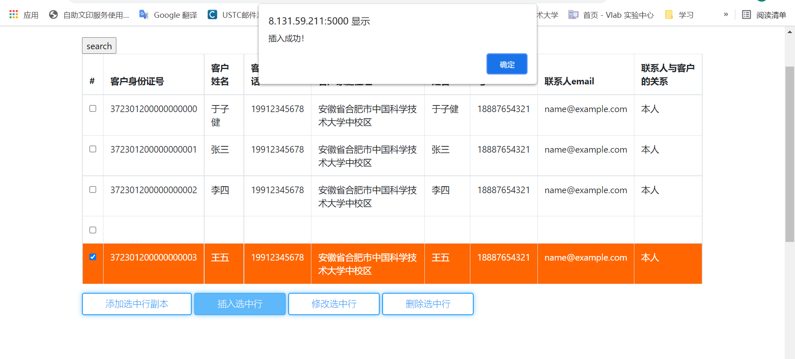

# 数据库lab3

## 大致思路

- 完成实验时，使用flask+python基于静态页面和动态数据，生成动态页面；静态页面使用jinjia模板库做模板渲染，模板在bootstrap示例的基础上修改而成；
- 后续考虑将架构修改为前后端分离式的架构，详见收藏夹几个网站。

## 实验过程

### 登陆页面

- 扒了一个觉得还不错的bootstrap登陆页面，效果如下

  

- 登录失败时，会根据失败后返回错误的两种类型，提示对应消息

  - 数据库名称错误

    

  - 用户名或密码错误

    

- 待实现checkbox打勾使用cookies“记住”

### 主页面

- 写了一个导航栏主页面，其中导航栏链接通过替换页面中的iframe内联框架实现页面之间的跳转；

- 主页面是数据库中所有表的count视图，同助教给的模板。

  

### 表单的附加功能

表单和按钮的样式也是从bootstrap的示例上扒下来的。

1. 实现了search得到的表单前面加上checkbox，使用checkbox来选择待操作的行，效果如下：

   

   选中后会变样式

   

   再次点击会取消选中。

2. 实现了双击使表单变成input块，用户可以修改表单内容，在此基础上进行操作

   

3. 实现了点击按钮，为表单添加已选中的所有行的副本，用户可以基于已有数据快速编造(bushi)新数据；

   副本是只显示在前端的，并不改变后端数据，只有使用相应的增删改功能按钮后，才会相应改变后端数据；

   点击按钮前：

   

   点击按钮后：

   

### 客户管理

1. 删除

   - 点击删除后会提示确认信息：

     

     点击确认后，若删除成功，会提示消息

     

     点击确认后刷新页面，发现成功删除

     

     ！尚未错误处理

2. 插入

   原始页面：

   

   增加副本并编辑，得到内容如下图：

   

   点击插入，提示信息和插入后页面如下：

   

   

   

   能看到插入成功。

   ！尚未错误处理

